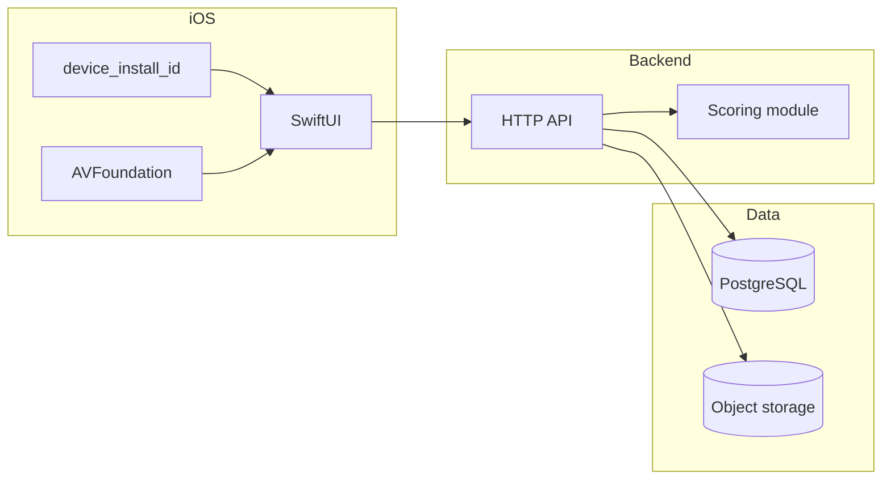

# Motifly

French dictation practice on iPhone: listen to a sentence, type what you hear, get structured feedback, and see where grammar and topic areas need work.

---

## What this repo is

Motifly is in **early design**. This repository holds:

- **`motifly_prd_mvp.md`** — original MVP product requirements (local-first, simpler tags).
- **`database_schema.md`** — **v1 PostgreSQL schema** and reference DDL (learner-centric, rich attempts, full-stack direction).

The **v1 engineering model** (below) goes beyond the original PRD in places: cloud backend, device-based learners, grammar as content, similarity scoring, and rollup progress. Application source (iOS app, API server) is **not** in the tree yet.

---

## v1 architecture

Cloud-backed, **no user accounts in v1**. Each install is a **`learner`** identified by a stable **`device_install_id`** (Keychain / UserDefaults). The API owns data; the scoring engine computes grades; Postgres stores events and aggregates; audio and images live in **object storage**.

**One attempt, end to end:** the client sends raw input (and optional timing) → the API loads the sentence → the **scoring module** returns normalized text, numeric scores, and **JSON feedback** → the API writes **`attempt_logs`** and updates **`sentence_progress`**, **`grammar_progress`**, and **`content_progress`** (typically in one transaction). Grading logic stays **out of SQL**; every attempt records a **`scoring_version`** so formulas can evolve.

---

## Mental model (what each layer is for)

| Unit | Role |
| ---- | ---- |
| **Practice content** | **`sentences`** — French + English + Chinese, optional audio/image keys, difficulty, system vs user-uploaded |
| **Teaching content** | **`grammar_topics`** — readable pages (`full_content` as markdown/text), slug for navigation—not flat labels |
| **Scene grouping** | **`content_tags`** — travel, restaurant, greetings, etc., via **`sentence_content_tags`** |
| **Grammar link** | **`sentence_grammar_topics`** — many grammar topics per sentence |
| **Learning events** | **`attempt_logs`** — append-only; similarity + optional subscores; **`feedback_payload`** (`jsonb`) |
| **Reporting** | **`sentence_progress`**, **`grammar_progress`**, **`content_progress`** — weak areas, review queues, summary screen |

Optional **`media_assets`** table tracks uploads (owner learner, storage key, MIME, size) so sentences can reference **`audio_media_id` / `image_media_id`** instead of only raw keys.

---

## Planned tech stack

| Layer | Direction |
| ----- | --------- |
| **iOS** | SwiftUI, URLSession, AVFoundation; optional SwiftData cache; stable device ID in Keychain or UserDefaults |
| **API** | TypeScript (Fastify/Hono) + Prisma/Drizzle, *or* Python FastAPI + SQLAlchemy |
| **Database** | PostgreSQL (e.g. Neon, Supabase, RDS) |
| **Media** | S3-compatible storage (e.g. R2, S3, MinIO locally); presigned PUT/GET |
| **Scoring** | Python-friendly stack (e.g. rapidfuzz, custom diffs) as subprocess, sidecar HTTP service, or embedded library—**DB stores outputs only** |

---

## v1 scope

- Backend API + PostgreSQL schema as in [`database_schema.md`](database_schema.md)
- Sentence library with translations and grammar/content associations
- Grammar topic **screens** backed by `grammar_topics`
- Presigned uploads for user audio/images
- Rich attempts + versioned scoring + **`feedback_payload`**
- Summary / weak-area UX using rollups and time-window queries on **`attempt_logs`**

## Explicitly later (not v1)

- Accounts, Sign in with Apple, JWT/sessions
- Social / sharing
- Daily rollup tables (optional when you need trend charts)
- CDN, microservices, job queues (add when scoring latency forces it)
- Heavy semantic / ML scoring at launch (`semantic_score` reserved, nullable)
- Large offline sync queues

---

## API sketch (`/v1`)

`device_install_id` is sent on bootstrap over HTTPS—**treat it like a secret** and rate-limit endpoints (no full auth yet).

| Method | Path | Purpose |
| ------ | ---- | ------- |
| `POST` | `/learners/bootstrap` | Upsert learner from `device_install_id`, optional `display_name` |
| `GET` | `/sentences` | List/filter by content tag, grammar topic, difficulty; weak-first via progress |
| `GET` | `/sentences/:id` | Detail + related grammar topics and content tags |
| `GET` | `/grammar-topics`, `/grammar-topics/:slug` | List / single grammar page |
| `GET` | `/content-tags` | List scene tags |
| `POST` | `/uploads/presign` | Presigned URL for learner upload |
| `POST` | `/sentences` | Create user-uploaded sentence; attach media after upload |
| `POST` | `/attempts` | Submit attempt → scorer → persist log + update aggregates |
| `GET` | `/learners/:id/summary` | Weakest grammar/content (rollups ± recent window on attempts) |

---

## Database tables (quick reference)

Full column lists, constraints, indexes, and SQL DDL: **[`database_schema.md`](database_schema.md)**.

| Table | Purpose |
| ----- | ------- |
| `learners` | v1 identity (`device_install_id`) |
| `sentences` | Practice unit + EN/ZH + media pointers + `source_type` / `owner_learner_id` |
| `grammar_topics` | Teachable grammar content + slug |
| `content_tags` | Scene/situation tags + slug |
| `sentence_grammar_topics` | M:N sentence ↔ grammar |
| `sentence_content_tags` | M:N sentence ↔ content tag |
| `attempt_logs` | Scored event + `feedback_payload` + `scoring_version` |
| `sentence_progress` | Per-learner sentence mastery / review signals |
| `grammar_progress` | Rollup for weak grammar summary |
| `content_progress` | Rollup for weak topic summary |
| `media_assets` | Optional upload ledger |

**Conventions:** UUID PKs, `timestamptz`, `jsonb` for structured feedback, `double precision` scores (document 0–1 vs 0–100 in the API).

---

## Suggested build order

1. Postgres migrations from `database_schema.md`
2. Scoring module + JSON I/O contract + `scoring_version` strings
3. API: bootstrap, sentences, attempt pipeline with transactional aggregate updates
4. Presign uploads + optional `media_assets`
5. Summary / weak-area queries
6. iOS: device ID lifecycle, practice UI, grammar reader, summary screen
7. Deploy API + database + bucket; document env vars and abuse limits

---

## After v1 (growth)

1. **Auth** — `users`, link or merge `learners`, JWT or Sign in with Apple  
2. **Trends** — `grammar_progress_daily` / `content_progress_daily`  
3. **Semantic score** — fill `semantic_score` when a model exists  
4. **Scale** — CDN in front of media; background worker + queue if needed  
5. **Admin** — CMS for sentences and grammar topics  

---

## Documentation index

| File | Contents |
| ---- | -------- |
| [`motifly_prd_mvp.md`](motifly_prd_mvp.md) | MVP user stories, screens, original local SwiftData scope |
| [`database_schema.md`](database_schema.md) | v1 schema, ER diagram, reference DDL, scoring boundary notes |

---

## License

Add a `LICENSE` file when you are ready to publish terms.
