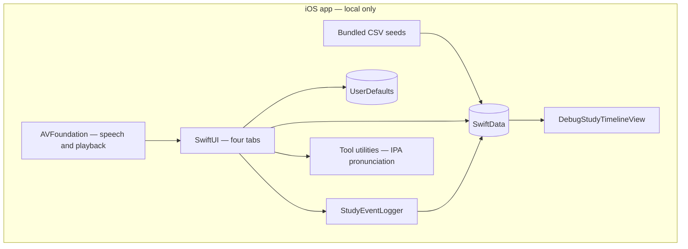
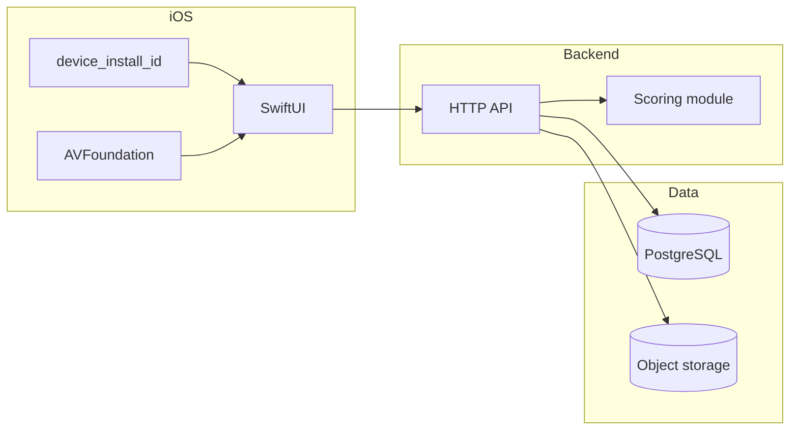

# Motifly

**Motifly** is a **local-first iOS French study app** built with **SwiftUI**, **SwiftData**, and **AVFoundation**.

It imports bundled CSV vocabulary seeds into SwiftData on first launch and provides searchable dictionary cards for nouns, verbs, adjectives, adverbs, determiners, pronouns, and prepositions. Each entry supports French TTS and optional user-recorded **“Mine” audio** for pronunciation comparison.

## Core Features

- **Vocabulary**: searchable dictionary, recent lookups, and kind-specific word cards.
- **Dictation**: listen to the French word audio, type the correct French lemma, and receive a normalization-based spelling check.
- **Study tracking**: grouped review sessions, per-word mastery, weakness signals, next-review hints, and append-only study events.
- **Memory model**: tracks each word with a mastery score, weakness buckets, review count, last-reviewed date, next-review hint, and attempt history to support spaced review decisions.
- **Home**: study dashboard with heatmap, progress cards, daily/weekly goals, settings, and debug timeline.
- **Tool**: utilities hub, currently including a French pronunciation IPA chart with example-word TTS.

## Memory Model

Motifly uses a lightweight local memory model to estimate how well each word has been learned.

For each vocabulary entry, the app can track:

- **Mastery score**: overall learning strength for the word.
- **Weakness buckets**: error categories such as spelling, accent marks, gender, conjugation, or recall difficulty.
- **Review count**: how many times the word has been practiced.
- **Correct / incorrect attempts**: historical performance across dictation sessions.
- **Last reviewed date**: when the word was last practiced.
- **Next-review hint**: a suggested review timing based on recent performance.
- **Attempt logs**: append-only study events that preserve previous answers and outcomes.

This model helps the app decide which words need more review, which words are becoming stable, and which specific weaknesses should be shown to the learner.

---

## Profile summary (copy for GitHub, LinkedIn, or résumé)

Use this block if you need a **truthful** one-screen description of the project as it exists in this repository.

**Motifly** — Personal iOS project (Swift / SwiftUI / SwiftData). Ships a **device-local French vocabulary** experience: bundled CSV seeds, SwiftData import, **Vocabulary** tab with search, recent lookups, and **kind-specific word cards** (nouns through prepositions). **Audio** uses **on-device** `AVSpeechSynthesizer` for French playback; vocabulary cards support optional **user-recorded “Mine”** takes for comparison. **Dictation** tab: **English prompt → type French lemma**, normalization-based check, grouped sessions/review, **per-word mastery and weakness signals** stored in SwiftData, and replayable per-attempt logs. **Home** is a study dashboard (heatmap, progress cards, daily/weekly goals), settings entry, and debug timeline for event validation. **Tool** tab: utilities hub with **French pronunciation** (IPA reference + example-word TTS).

**Not implemented in the client yet** (described only as **target** design in `docs/database_schema.md` / README): remote APIs for audio, sentence-level dictation with grammar tagging, retrieval scoring, review logs backed by a server, and real image upload pipelines.

---

## What this repo is

Motifly is in **active development**. This repository holds:

- **`ios/Motifly/`** — SwiftUI iOS app (local-first vocabulary, dictation, tool utilities; see **Current architecture** below).
- **`docs/motifly_prd_mvp.md`** — original MVP product requirements (local-first, simpler tags).
- **`docs/database_schema.md`** — **target PostgreSQL schema** and reference DDL (learner-centric, rich attempts, full-stack direction) for a future cloud-backed phase.

The **target at-scale engineering model** (later section) goes beyond the original PRD: cloud backend, device-based learners, grammar as content, similarity scoring, and rollup progress. That stack is **not** implemented in the app yet; the shipped client is described under **Current architecture**.

---

## Current architecture

What runs in the tree **today**: a **single iOS client**, no backend service in this repo. Data stays on device.

| Area | Implementation |
| ---- | ---------------- |
| **UI** | SwiftUI (`TabView`: **Home**, **Vocabulary**, **Dictation**, **Tool**). |
| **Persistence** | SwiftData over SQLite under Application Support (`VocabularyEntry`, `SearchHistoryEntry`, `DictationSession`, `DictationAttemptLog`, `DictationWordStats`, `VocabularyStudyEvent`). |
| **Content load** | Bundled CSVs under `ios/Motifly/SeedData/` (copies of `data_seed/`); `CSVImportService` imports on first launch. |
| **Vocabulary** | Search and recent history; entries open noun, verb, adjective, adverb, determiner, pronoun, or preposition word cards by kind. |
| **Dictation** | Lemma typing against English gloss; units grouped by seed `group assigned` (with fallback). Per-attempt logs, spelling-focused error classification, `WordMasteryUpdater` updating `DictationWordStats` (mastery, main weakness, next review). Manual/auto playback (`DictationPlaybackEngine`), group review and weak-first ordering in the relevant UI. |
| **Tools** | `ToolView` hub; **French pronunciation** (`FrenchPronunciationToolView`) — IPA sections (oral / nasal / semi / consonants), All / Vowels / Consonants filters, example-word TTS (stateless; no SwiftData). |
| **Audio** | AVFoundation: French TTS for lemmas and tool examples; optional user “Mine” recordings per vocabulary entry; playback profiles for dictation auto flow. |

### Dictation memory model (V1, local)

The app implements a **per-word dictation memory model** on device: after each attempt, **`WordMasteryUpdater`** refreshes **`DictationWordStats`** with simplified **mastery** scores, **spelling-only** weakness buckets, **main weakness** labeling, and a **next review** schedule—grounded in attempt logs, replay/hint signals, and explicit design notes in the repo.

**Design references (implemented direction, not future cloud schema):**

| Document | Role |
| -------- | ---- |
| [`docs/french_dictation_memory_model.md`](docs/french_dictation_memory_model.md) | V1 memory model for dictation: concepts, fields, and how aggregates evolve from attempts. |
| [`docs/mastery_weakness_next_review.zh.md`](docs/mastery_weakness_next_review.zh.md) | Mastery / weakness / next-review algorithm and how it surfaces in UI (Chinese). |

Code touchpoints: `DictationWordStats`, `WordMasteryUpdater`, `DictationErrorClassifier`, `DictationWordOrdering`, dictation/review/word-card views that show mastery or weakness.

### Current local schema and timeline

The running app now maintains an append-only study timeline in local SwiftData:

- `VocabularyStudyEvent`: `id`, `seedNumber`, `eventType`, `occurredAt`, `contextJSON`
- `contextJSON` is currently serialized from a flat `[String: String]` context map
- events are written from vocabulary cards, dictation sessions, review interactions, and dictation-progress state transitions
- append-only is enforced by app write-path convention (not a DB-level immutability constraint)
- `DictationProgressStore` still keeps progress state in `UserDefaults`, mirrored into timeline events for chronological visibility
- this timeline is visible in-app via `DebugStudyTimelineView` for fast end-to-end verification

More detail for day-to-day development: [`ios/Motifly/README.md`](ios/Motifly/README.md).

---

## Target architecture (cloud-scale, future)

This section describes the **planned** platform for when core product features are ready to move beyond a local-only client: API, Postgres, scoring service, and object storage. It is **not** the architecture of the current app.

Cloud-backed, **no user accounts in the first cloud phase**. Each install is a **`learner`** identified by a stable **`device_install_id`** (Keychain / UserDefaults). The API owns data; the scoring engine computes grades; Postgres stores events and aggregates; audio and images live in **object storage**.

**One attempt, end to end:** the client sends raw input (and optional timing) → the API loads the sentence → the **scoring module** returns normalized text, numeric scores, and **JSON feedback** → the API writes **`attempt_logs`** and updates **`sentence_progress`**, **`grammar_progress`**, and **`content_progress`** (typically in one transaction). Grading logic stays **out of SQL**; every attempt records a **`scoring_version`** so formulas can evolve.

---

## Mental model (what each layer is for)

*PostgreSQL concepts for the **target** cloud platform in [`docs/database_schema.md`](docs/database_schema.md). The running app uses SwiftData models locally instead.*

| Unit | Role |
| ---- | ---- |
| **Practice content** | **`sentences`** — French + English + Chinese, optional audio/image keys, difficulty, system vs user-uploaded |
| **Teaching content** | **`grammar_topics`** — readable pages (`full_content` as markdown/text), slug for navigation—not flat labels |
| **Scene grouping** | **`content_tags`** — travel, restaurant, greetings, etc., via **`sentence_content_tags`** |
| **Grammar link** | **`sentence_grammar_topics`** — many grammar topics per sentence |
| **Learning events** | **`attempt_logs`** — append-only; similarity + optional subscores; **`feedback_payload`** (`jsonb`) |
| **Reporting** | **`sentence_progress`**, **`grammar_progress`**, **`content_progress`** — weak areas, review queues, summary screen |

Optional **`media_assets`** table tracks uploads (owner learner, storage key, MIME, size) so sentences can reference **`audio_media_id` / `image_media_id`** instead of only raw keys.

---

## Planned tech stack (target platform)

| Layer | Direction |
| ----- | --------- |
| **iOS** | SwiftUI, URLSession, AVFoundation; optional SwiftData cache; stable device ID in Keychain or UserDefaults |
| **API** | TypeScript (Fastify/Hono) + Prisma/Drizzle, *or* Python FastAPI + SQLAlchemy |
| **Database** | PostgreSQL (e.g. Neon, Supabase, RDS) |
| **Media** | S3-compatible storage (e.g. R2, S3, MinIO locally); presigned PUT/GET |
| **Scoring** | Python-friendly stack (e.g. rapidfuzz, custom diffs) as subprocess, sidecar HTTP service, or embedded library—**DB stores outputs only** |

---

## Target scope (cloud-backed product)

- Backend API + PostgreSQL schema as in [`docs/database_schema.md`](docs/database_schema.md)
- Sentence library with translations and grammar/content associations
- Grammar topic **screens** backed by `grammar_topics`
- Presigned uploads for user audio/images
- Rich attempts + versioned scoring + **`feedback_payload`**
- Summary / weak-area UX using rollups and time-window queries on **`attempt_logs`**

## Explicitly later (not in first cloud phase)

- Accounts, Sign in with Apple, JWT/sessions
- Social / sharing
- Daily rollup tables (optional when you need trend charts)
- CDN, microservices, job queues (add when scoring latency forces it)
- Heavy semantic / ML scoring at launch (`semantic_score` reserved, nullable)
- Large offline sync queues

---

## API sketch (target `/v1`)

`device_install_id` is sent on bootstrap over HTTPS—**treat it like a secret** and rate-limit endpoints (no full auth yet).

| Method | Path | Purpose |
| ------ | ---- | ------- |
| `POST` | `/learners/bootstrap` | Upsert learner from `device_install_id`, optional `display_name` |
| `GET` | `/sentences` | List/filter by content tag, grammar topic, difficulty; weak-first via progress |
| `GET` | `/sentences/:id` | Detail + related grammar topics and content tags |
| `GET` | `/grammar-topics`, `/grammar-topics/:slug` | List / single grammar page |
| `GET` | `/content-tags` | List scene tags |
| `POST` | `/uploads/presign` | Presigned URL for learner upload |
| `POST` | `/sentences` | Create user-uploaded sentence; attach media after upload |
| `POST` | `/attempts` | Submit attempt → scorer → persist log + update aggregates |
| `GET` | `/learners/:id/summary` | Weakest grammar/content (rollups ± recent window on attempts) |

---

## Database tables (quick reference)

Full column lists, constraints, indexes, and SQL DDL: **[`docs/database_schema.md`](docs/database_schema.md)**.

| Table | Purpose |
| ----- | ------- |
| `learners` | v1 identity (`device_install_id`) |
| `sentences` | Practice unit + EN/ZH + media pointers + `source_type` / `owner_learner_id` |
| `grammar_topics` | Teachable grammar content + slug |
| `content_tags` | Scene/situation tags + slug |
| `sentence_grammar_topics` | M:N sentence ↔ grammar |
| `sentence_content_tags` | M:N sentence ↔ content tag |
| `attempt_logs` | Scored event + `feedback_payload` + `scoring_version` |
| `sentence_progress` | Per-learner sentence mastery / review signals |
| `grammar_progress` | Rollup for weak grammar summary |
| `content_progress` | Rollup for weak topic summary |
| `media_assets` | Optional upload ledger |

**Conventions:** UUID PKs, `timestamptz`, `jsonb` for structured feedback, `double precision` scores (document 0–1 vs 0–100 in the API).

---

## Suggested build order

1. Postgres migrations from `docs/database_schema.md`
2. Scoring module + JSON I/O contract + `scoring_version` strings
3. API: bootstrap, sentences, attempt pipeline with transactional aggregate updates
4. Presign uploads + optional `media_assets`
5. Summary / weak-area queries
6. iOS: device ID lifecycle, practice UI, grammar reader, summary screen
7. Deploy API + database + bucket; document env vars and abuse limits

---

## After first cloud release (growth)

1. **Auth** — `users`, link or merge `learners`, JWT or Sign in with Apple  
2. **Trends** — `grammar_progress_daily` / `content_progress_daily`  
3. **Semantic score** — fill `semantic_score` when a model exists  
4. **Scale** — CDN in front of media; background worker + queue if needed  
5. **Admin** — CMS for sentences and grammar topics  

---

## Documentation index

| File | Contents |
| ---- | -------- |
| [`docs/motifly_prd_mvp.md`](docs/motifly_prd_mvp.md) | MVP user stories, screens, original local SwiftData scope |
| [`docs/database_schema.md`](docs/database_schema.md) | Target PostgreSQL schema, ER diagram, reference DDL, scoring boundary notes |
| [`docs/database_schema.zh.md`](docs/database_schema.zh.md) | 数据库说明（中文，与英文 DDL 对照） |
| [`docs/database_schema_v1_vocab.md`](docs/database_schema_v1_vocab.md) | v1 词汇 / SwiftData 侧字段说明（非 Postgres v2） |
| [`docs/french_dictation_memory_model.md`](docs/french_dictation_memory_model.md) | 听写记忆模型 V1 设计长文 |
| [`docs/mastery_weakness_next_review.zh.md`](docs/mastery_weakness_next_review.zh.md) | Mastery / Weakness / Next Review 算法与展示（中文） |

---

## License

Add a `LICENSE` file when you are ready to publish terms.
