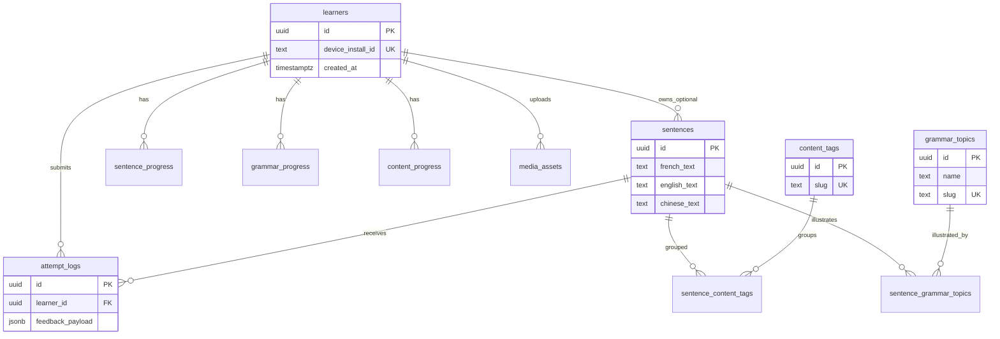

# Motifly — PostgreSQL schema (v1, learner-centric)

This document describes the **v1 relational schema** for Motifly: **no accounts/auth**; identity via **`learners`** (device install); **grammar** as teachable **`grammar_topics`**; **scene/topic** grouping via **`content_tags`**; **rich attempts** with similarity and JSON feedback; **rollup progress** at sentence, grammar, and content levels. Blobs live in **object storage**, not in Postgres.

Design mental model (avoid overloading one table):

| Unit | Table(s) | Role |
| ---- | -------- | ---- |
| Practice content | `sentences` (+ junctions) | What the user dictates |
| Teaching content | `grammar_topics` | Readable grammar pages |
| Scene grouping | `content_tags` | Travel, restaurant, etc. |
| Learning event | `attempt_logs` | Append-only performance record |
| Reporting / recommendations | `sentence_progress`, `grammar_progress`, `content_progress` | Aggregates for weak areas & summary UI |

Aligned with product direction in [motifly_prd_mvp.md](motifly_prd_mvp.md) where it still applies; extends PRD with translations, grammar pages, richer scoring, and **no JWT in v1**.

---

## v1 scope vs deferred (growth)

**In v1**

- `learners` + `device_install_id` (Keychain / UserDefaults–backed UUID on device)
- Content tables + junctions
- `attempt_logs` with `feedback_payload` **jsonb** and `scoring_version`
- Aggregate progress tables (updated by API after scoring engine runs)
- Presigned uploads to object storage; optional `media_assets` for audit

**Deferred (easy adds later)**

- `users`, Sign in with Apple, JWT — link `learners` → `users` with nullable `user_id` on `learners` when you add auth
- Daily rollup tables (`grammar_progress_daily`, `content_progress_daily`) for trend charts
- Heavy **semantic** scoring — keep `semantic_score` nullable until a model exists
- Per-character normalized tables (keep JSON in v1)
- CDN, microservices, job queues (add queue when scoring latency forces it)

---

## Conventions

| Item | Choice |
| ---- | ------ |
| Primary keys | `uuid` default `gen_random_uuid()` |
| Timestamps | `timestamptz` UTC |
| Text | `text` for French/English/Chinese and long-form grammar |
| Scores | `double precision` for 0–1 style metrics (document scale in API); nullable where not computed |
| Structured feedback | `jsonb` — token/char diff, missing words, etc. |
| Booleans | `boolean NOT NULL` with defaults where applicable |

---

## Entity relationship (overview)



---

## Table: `learners`

Anonymous learner bound to one app install (v1 identity).

| Column | Type | Nullable | Default | Description |
| ------ | ---- | -------- | ------- | ----------- |
| `id` | `uuid` | NO | `gen_random_uuid()` | Primary key |
| `device_install_id` | `text` | NO | | Stable ID from device (treat as secret in API design) |
| `display_name` | `text` | YES | | Optional nickname |
| `created_at` | `timestamptz` | NO | `now()` | First seen |
| `last_seen_at` | `timestamptz` | NO | `now()` | Updated on each API touch |

**Constraints**

- `UNIQUE (device_install_id)`

**Indexes**

- `learners_pkey` on `(id)`
- `learners_device_install_id_key` unique on `(device_install_id)`

**Growth:** add `user_id uuid NULL REFERENCES users(id)` when accounts ship; migrate by merging learners or linking rows.

---

## Table: `sentences`

Primary **practice unit**; includes translations for display and learning.

| Column | Type | Nullable | Default | Description |
| ------ | ---- | -------- | ------- | ----------- |
| `id` | `uuid` | NO | `gen_random_uuid()` | Primary key |
| `french_text` | `text` | NO | | Canonical reference for scoring |
| `english_text` | `text` | NO | | Translation |
| `chinese_text` | `text` | NO | | Translation |
| `notes` | `text` | YES | | Editor notes / hints |
| `difficulty_level` | `smallint` | NO | `1` | 1–5 or app-defined scale |
| `audio_storage_key` | `text` | YES | | Object key for audio |
| `image_storage_key` | `text` | YES | | Object key for image |
| `audio_media_id` | `uuid` | YES | | Optional FK → `media_assets.id` |
| `image_media_id` | `uuid` | YES | | Optional FK → `media_assets.id` |
| `source_type` | `text` | NO | `'system'` | `system` \| `user_uploaded` (enforce with `CHECK`) |
| `owner_learner_id` | `uuid` | YES | | Set when `user_uploaded`; FK → `learners.id` |
| `is_active` | `boolean` | NO | `true` | Soft hide without delete |
| `created_at` | `timestamptz` | NO | `now()` | |
| `updated_at` | `timestamptz` | NO | `now()` | |

**Constraints**

- `FOREIGN KEY (owner_learner_id) REFERENCES learners(id) ON DELETE SET NULL`
- `CHECK (source_type IN ('system', 'user_uploaded'))`
- `CHECK` (optional): `source_type = 'user_uploaded' AND owner_learner_id IS NOT NULL` OR allow system with null owner

**Indexes**

- `sentences_pkey` on `(id)`
- `sentences_owner_learner_id_idx` on `(owner_learner_id)` where not null
- `sentences_is_active_idx` on `(is_active)` where `is_active = true`
- `sentences_difficulty_idx` on `(difficulty_level)`

**Scoring snapshot:** attempts store `reference_text_snapshot` so edits to `french_text` do not rewrite history.

---

## Table: `grammar_topics`

**Teaching knowledge unit** — not a mere label. Drives grammar screen + rollup weakness.

| Column | Type | Nullable | Default | Description |
| ------ | ---- | -------- | ------- | ----------- |
| `id` | `uuid` | NO | `gen_random_uuid()` | Primary key |
| `name` | `text` | NO | | Display title |
| `slug` | `text` | NO | | Unique route key (e.g. `passe-compose`) |
| `short_description` | `text` | YES | | Card / list blurb |
| `full_content` | `text` | NO | | v1: markdown or plain text |
| `difficulty_level` | `smallint` | NO | `1` | Aligns with product difficulty |
| `screen_route` | `text` | YES | | Optional deep link path in app |
| `is_active` | `boolean` | NO | `true` | |
| `created_at` | `timestamptz` | NO | `now()` | |
| `updated_at` | `timestamptz` | NO | `now()` | |

**Constraints**

- `UNIQUE (slug)`
- `UNIQUE (lower(name))` optional if names must be unique

**Indexes**

- `grammar_topics_slug_key` on `(slug)`

**Growth:** `example_sentence_ids` is better modeled as this table’s inverse via `sentence_grammar_topics` (already many-to-many); avoid duplicating arrays in v1.

---

## Table: `content_tags`

Scene / situational grouping (travel, restaurant, apology, etc.).

| Column | Type | Nullable | Default | Description |
| ------ | ---- | -------- | ------- | ----------- |
| `id` | `uuid` | NO | `gen_random_uuid()` | Primary key |
| `name` | `text` | NO | | Display name |
| `slug` | `text` | NO | | Unique |
| `description` | `text` | YES | | |
| `created_at` | `timestamptz` | NO | `now()` | |

**Constraints**

- `UNIQUE (slug)`

**Indexes**

- `content_tags_slug_key` on `(slug)`

---

## Table: `sentence_grammar_topics`

Many-to-many: one sentence can illustrate several grammar topics.

| Column | Type | Nullable | Description |
| ------ | ---- | -------- | ----------- |
| `sentence_id` | `uuid` | NO | FK → `sentences.id` |
| `grammar_topic_id` | `uuid` | NO | FK → `grammar_topics.id` |

**Constraints**

- `PRIMARY KEY (sentence_id, grammar_topic_id)`
- `ON DELETE CASCADE` on both FKs

**Indexes**

- `sentence_grammar_topics_grammar_idx` on `(grammar_topic_id)` for “sentences in this topic”

---

## Table: `sentence_content_tags`

Many-to-many: sentence ↔ content tag.

| Column | Type | Nullable | Description |
| ------ | ---- | -------- | ----------- |
| `sentence_id` | `uuid` | NO | FK → `sentences.id` |
| `content_tag_id` | `uuid` | NO | FK → `content_tags.id` |

**Constraints**

- `PRIMARY KEY (sentence_id, content_tag_id)`
- `ON DELETE CASCADE` on both FKs

**Indexes**

- `sentence_content_tags_tag_idx` on `(content_tag_id)`

---

## Table: `attempt_logs`

**Rich performance event** — grading logic lives in a **scoring module**; DB stores inputs, outputs, and version.

| Column | Type | Nullable | Default | Description |
| ------ | ---- | -------- | ------- | ----------- |
| `id` | `uuid` | NO | `gen_random_uuid()` | Primary key |
| `learner_id` | `uuid` | NO | | FK → `learners.id` |
| `sentence_id` | `uuid` | NO | | FK → `sentences.id` |
| `raw_input_text` | `text` | NO | | As typed |
| `normalized_input_text` | `text` | NO | | After NFC trim / case rules (engine-defined) |
| `reference_text_snapshot` | `text` | NO | | Copy of reference French at attempt time |
| `similarity_score` | `double precision` | NO | | Primary composite metric (define 0–1 vs 0–100 in API docs) |
| `spelling_score` | `double precision` | YES | | Subscore when computed |
| `grammar_accuracy_score` | `double precision` | YES | | Subscore when computed |
| `semantic_score` | `double precision` | YES | | Reserved for future ML |
| `input_duration_ms` | `integer` | YES | | Time from prompt to submit if tracked |
| `character_count` | `integer` | YES | | |
| `token_count` | `integer` | YES | | Word/token count (definition in scoring version) |
| `feedback_payload` | `jsonb` | NO | `'{}'` | Per-token/char feedback, missing words, etc. |
| `scoring_version` | `text` | NO | | e.g. `sim-2026-04-01` |
| `created_at` | `timestamptz` | NO | `now()` | |

**Constraints**

- `FOREIGN KEY (learner_id) REFERENCES learners(id) ON DELETE CASCADE`
- `FOREIGN KEY (sentence_id) REFERENCES sentences(id) ON DELETE CASCADE`

**Indexes**

- `attempt_logs_learner_created_idx` on `(learner_id, created_at DESC)` — time-window analytics
- `attempt_logs_learner_sentence_created_idx` on `(learner_id, sentence_id, created_at DESC)`
- Optional **GIN** on `feedback_payload` only if you query inside JSON heavily (v1 usually not needed)

---

## Table: `sentence_progress`

Per-learner aggregates for one sentence (updated after each scored attempt).

| Column | Type | Nullable | Default | Description |
| ------ | ---- | -------- | ------- | ----------- |
| `learner_id` | `uuid` | NO | | FK → `learners.id` |
| `sentence_id` | `uuid` | NO | | FK → `sentences.id` |
| `attempt_count` | `integer` | NO | `0` | |
| `latest_similarity_score` | `double precision` | YES | | Last attempt |
| `best_similarity_score` | `double precision` | YES | | Max so far |
| `average_similarity_score` | `double precision` | YES | | Running mean (or recompute in app layer) |
| `average_input_duration_ms` | `double precision` | YES | | |
| `retrieval_score` | `double precision` | NO | `0` | Engine-defined retrieval signal |
| `mastery_score` | `double precision` | NO | `0` | Combined mastery (document formula per `scoring_version`) |
| `needs_review` | `boolean` | NO | `false` | Derived flag for UI |
| `last_attempted_at` | `timestamptz` | YES | | |
| `updated_at` | `timestamptz` | NO | `now()` | |

**Constraints**

- `PRIMARY KEY (learner_id, sentence_id)`
- `FOREIGN KEY (learner_id) REFERENCES learners(id) ON DELETE CASCADE`
- `FOREIGN KEY (sentence_id) REFERENCES sentences(id) ON DELETE CASCADE`
- `CHECK (attempt_count >= 0)`

**Indexes**

- `sentence_progress_weak_idx` on `(learner_id, mastery_score ASC, last_attempted_at DESC NULLS LAST)` for review queues

---

## Table: `grammar_progress`

Rollup of performance across all sentences linked to a grammar topic.

| Column | Type | Nullable | Default | Description |
| ------ | ---- | -------- | ------- | ----------- |
| `learner_id` | `uuid` | NO | | FK → `learners.id` |
| `grammar_topic_id` | `uuid` | NO | | FK → `grammar_topics.id` |
| `sentence_coverage_count` | `integer` | NO | `0` | Distinct sentences practiced in this topic |
| `attempt_count` | `integer` | NO | `0` | Total attempts on sentences tagged with topic |
| `average_similarity_score` | `double precision` | YES | | Weighted or simple avg (document in service) |
| `retrieval_score` | `double precision` | NO | `0` | |
| `mastery_score` | `double precision` | NO | `0` | |
| `last_practiced_at` | `timestamptz` | YES | | |
| `updated_at` | `timestamptz` | NO | `now()` | |

**Constraints**

- `PRIMARY KEY (learner_id, grammar_topic_id)`
- `FOREIGN KEY (learner_id) REFERENCES learners(id) ON DELETE CASCADE`
- `FOREIGN KEY (grammar_topic_id) REFERENCES grammar_topics(id) ON DELETE CASCADE`

**Indexes**

- `grammar_progress_weak_idx` on `(learner_id, mastery_score ASC, last_practiced_at DESC NULLS LAST)` for **summary screen**

---

## Table: `content_progress`

Same idea for **content tags**.

| Column | Type | Nullable | Default | Description |
| ------ | ---- | -------- | ------- | ----------- |
| `learner_id` | `uuid` | NO | | FK → `learners.id` |
| `content_tag_id` | `uuid` | NO | | FK → `content_tags.id` |
| `sentence_coverage_count` | `integer` | NO | `0` | |
| `attempt_count` | `integer` | NO | `0` | |
| `average_similarity_score` | `double precision` | YES | | |
| `retrieval_score` | `double precision` | NO | `0` | |
| `mastery_score` | `double precision` | NO | `0` | |
| `last_practiced_at` | `timestamptz` | YES | | |
| `updated_at` | `timestamptz` | NO | `now()` | |

**Constraints**

- `PRIMARY KEY (learner_id, content_tag_id)`
- `FOREIGN KEY (learner_id) REFERENCES learners(id) ON DELETE CASCADE`
- `FOREIGN KEY (content_tag_id) REFERENCES content_tags(id) ON DELETE CASCADE`

**Indexes**

- `content_progress_weak_idx` on `(learner_id, mastery_score ASC, last_practiced_at DESC NULLS LAST)`

---

## Table: `media_assets` (optional, recommended for uploads)

Tracks uploaded blobs with metadata; sentences can reference rows for cleaner lifecycle.

| Column | Type | Nullable | Default | Description |
| ------ | ---- | -------- | ------- | ----------- |
| `id` | `uuid` | NO | `gen_random_uuid()` | Primary key |
| `owner_learner_id` | `uuid` | NO | | FK → `learners.id` |
| `storage_key` | `text` | NO | | Unique object key |
| `media_type` | `text` | NO | | `audio` \| `image` (`CHECK`) |
| `content_type` | `text` | NO | | MIME |
| `byte_size` | `bigint` | NO | | |
| `duration_ms` | `integer` | YES | | For audio |
| `created_at` | `timestamptz` | NO | `now()` | |

**Constraints**

- `FOREIGN KEY (owner_learner_id) REFERENCES learners(id) ON DELETE CASCADE`
- `UNIQUE (storage_key)`

If you skip this table in the very first sprint, nullable `audio_storage_key` / `image_storage_key` on `sentences` still work; migrate to `media_assets` when upload auditing matters.

---

## Summary screen & time windows

**v1 approach:** keep aggregate tables current; for “weakest in last 7 days” run **queries on `attempt_logs`** filtered by `created_at`, joining through `sentence_grammar_topics` / `sentence_content_tags` to group by topic/tag. This avoids daily rollups until charts need them.

Example direction (not optimized to final SQL):

- Weakest grammar: `GROUP BY grammar_topic_id` over attempts in window, `AVG(similarity_score)`.
- Weakest content: same via `content_tag_id`.

Add **partial indexes** on `attempt_logs(created_at)` if windows become hot.

---

## Scoring module (application boundary)

Postgres **does not** implement similarity or mastery formulas. Recommended flow:

1. API receives attempt + timing metadata.
2. **Scoring engine** (Python module, subprocess, or sidecar) returns normalized text, scores, `feedback_payload`, retrieval/mastery deltas.
3. API writes `attempt_logs`, then updates `sentence_progress`, `grammar_progress`, `content_progress` in one transaction (or saga if engine is async).

Version every change with `scoring_version` on each attempt; aggregates can store implicit “last updated for version X” in app config or a small `app_config` table later.

---

## Reference DDL (PostgreSQL)

Illustrative — adapt to Prisma/Drizzle/Alembic.

```sql
CREATE EXTENSION IF NOT EXISTS "pgcrypto";

CREATE TABLE learners (
  id uuid PRIMARY KEY DEFAULT gen_random_uuid(),
  device_install_id text NOT NULL UNIQUE,
  display_name text,
  created_at timestamptz NOT NULL DEFAULT now(),
  last_seen_at timestamptz NOT NULL DEFAULT now()
);

CREATE TABLE grammar_topics (
  id uuid PRIMARY KEY DEFAULT gen_random_uuid(),
  name text NOT NULL,
  slug text NOT NULL UNIQUE,
  short_description text,
  full_content text NOT NULL,
  difficulty_level smallint NOT NULL DEFAULT 1,
  screen_route text,
  is_active boolean NOT NULL DEFAULT true,
  created_at timestamptz NOT NULL DEFAULT now(),
  updated_at timestamptz NOT NULL DEFAULT now()
);

CREATE TABLE content_tags (
  id uuid PRIMARY KEY DEFAULT gen_random_uuid(),
  name text NOT NULL,
  slug text NOT NULL UNIQUE,
  description text,
  created_at timestamptz NOT NULL DEFAULT now()
);

CREATE TABLE media_assets (
  id uuid PRIMARY KEY DEFAULT gen_random_uuid(),
  owner_learner_id uuid NOT NULL REFERENCES learners (id) ON DELETE CASCADE,
  storage_key text NOT NULL UNIQUE,
  media_type text NOT NULL,
  content_type text NOT NULL,
  byte_size bigint NOT NULL,
  duration_ms integer,
  created_at timestamptz NOT NULL DEFAULT now(),
  CONSTRAINT media_assets_type_check CHECK (media_type IN ('audio', 'image'))
);

CREATE TABLE sentences (
  id uuid PRIMARY KEY DEFAULT gen_random_uuid(),
  french_text text NOT NULL,
  english_text text NOT NULL,
  chinese_text text NOT NULL,
  notes text,
  difficulty_level smallint NOT NULL DEFAULT 1,
  audio_storage_key text,
  image_storage_key text,
  audio_media_id uuid REFERENCES media_assets (id) ON DELETE SET NULL,
  image_media_id uuid REFERENCES media_assets (id) ON DELETE SET NULL,
  source_type text NOT NULL DEFAULT 'system',
  owner_learner_id uuid REFERENCES learners (id) ON DELETE SET NULL,
  is_active boolean NOT NULL DEFAULT true,
  created_at timestamptz NOT NULL DEFAULT now(),
  updated_at timestamptz NOT NULL DEFAULT now(),
  CONSTRAINT sentences_source_check CHECK (source_type IN ('system', 'user_uploaded'))
);

CREATE INDEX sentences_owner_idx ON sentences (owner_learner_id);
CREATE INDEX sentences_active_idx ON sentences (is_active) WHERE is_active;

CREATE TABLE sentence_grammar_topics (
  sentence_id uuid NOT NULL REFERENCES sentences (id) ON DELETE CASCADE,
  grammar_topic_id uuid NOT NULL REFERENCES grammar_topics (id) ON DELETE CASCADE,
  PRIMARY KEY (sentence_id, grammar_topic_id)
);
CREATE INDEX sgt_grammar_idx ON sentence_grammar_topics (grammar_topic_id);

CREATE TABLE sentence_content_tags (
  sentence_id uuid NOT NULL REFERENCES sentences (id) ON DELETE CASCADE,
  content_tag_id uuid NOT NULL REFERENCES content_tags (id) ON DELETE CASCADE,
  PRIMARY KEY (sentence_id, content_tag_id)
);
CREATE INDEX sct_tag_idx ON sentence_content_tags (content_tag_id);

CREATE TABLE attempt_logs (
  id uuid PRIMARY KEY DEFAULT gen_random_uuid(),
  learner_id uuid NOT NULL REFERENCES learners (id) ON DELETE CASCADE,
  sentence_id uuid NOT NULL REFERENCES sentences (id) ON DELETE CASCADE,
  raw_input_text text NOT NULL,
  normalized_input_text text NOT NULL,
  reference_text_snapshot text NOT NULL,
  similarity_score double precision NOT NULL,
  spelling_score double precision,
  grammar_accuracy_score double precision,
  semantic_score double precision,
  input_duration_ms integer,
  character_count integer,
  token_count integer,
  feedback_payload jsonb NOT NULL DEFAULT '{}',
  scoring_version text NOT NULL,
  created_at timestamptz NOT NULL DEFAULT now()
);
CREATE INDEX attempt_logs_learner_time_idx ON attempt_logs (learner_id, created_at DESC);
CREATE INDEX attempt_logs_learner_sentence_time_idx ON attempt_logs (learner_id, sentence_id, created_at DESC);

CREATE TABLE sentence_progress (
  learner_id uuid NOT NULL REFERENCES learners (id) ON DELETE CASCADE,
  sentence_id uuid NOT NULL REFERENCES sentences (id) ON DELETE CASCADE,
  attempt_count integer NOT NULL DEFAULT 0,
  latest_similarity_score double precision,
  best_similarity_score double precision,
  average_similarity_score double precision,
  average_input_duration_ms double precision,
  retrieval_score double precision NOT NULL DEFAULT 0,
  mastery_score double precision NOT NULL DEFAULT 0,
  needs_review boolean NOT NULL DEFAULT false,
  last_attempted_at timestamptz,
  updated_at timestamptz NOT NULL DEFAULT now(),
  PRIMARY KEY (learner_id, sentence_id),
  CONSTRAINT sentence_progress_attempt_nonneg CHECK (attempt_count >= 0)
);
CREATE INDEX sentence_progress_weak_idx ON sentence_progress (learner_id, mastery_score, last_attempted_at DESC NULLS LAST);

CREATE TABLE grammar_progress (
  learner_id uuid NOT NULL REFERENCES learners (id) ON DELETE CASCADE,
  grammar_topic_id uuid NOT NULL REFERENCES grammar_topics (id) ON DELETE CASCADE,
  sentence_coverage_count integer NOT NULL DEFAULT 0,
  attempt_count integer NOT NULL DEFAULT 0,
  average_similarity_score double precision,
  retrieval_score double precision NOT NULL DEFAULT 0,
  mastery_score double precision NOT NULL DEFAULT 0,
  last_practiced_at timestamptz,
  updated_at timestamptz NOT NULL DEFAULT now(),
  PRIMARY KEY (learner_id, grammar_topic_id)
);
CREATE INDEX grammar_progress_weak_idx ON grammar_progress (learner_id, mastery_score, last_practiced_at DESC NULLS LAST);

CREATE TABLE content_progress (
  learner_id uuid NOT NULL REFERENCES learners (id) ON DELETE CASCADE,
  content_tag_id uuid NOT NULL REFERENCES content_tags (id) ON DELETE CASCADE,
  sentence_coverage_count integer NOT NULL DEFAULT 0,
  attempt_count integer NOT NULL DEFAULT 0,
  average_similarity_score double precision,
  retrieval_score double precision NOT NULL DEFAULT 0,
  mastery_score double precision NOT NULL DEFAULT 0,
  last_practiced_at timestamptz,
  updated_at timestamptz NOT NULL DEFAULT now(),
  PRIMARY KEY (learner_id, content_tag_id)
);
CREATE INDEX content_progress_weak_idx ON content_progress (learner_id, mastery_score, last_practiced_at DESC NULLS LAST);
```

---

## Table index (quick reference)

| Table | Purpose |
| ----- | ------- |
| `learners` | v1 identity (device install) |
| `sentences` | Practice unit + translations + media pointers |
| `grammar_topics` | Teachable grammar pages |
| `content_tags` | Scene/situation tags |
| `sentence_grammar_topics` | M:N sentence ↔ grammar |
| `sentence_content_tags` | M:N sentence ↔ content |
| `attempt_logs` | Scored attempts + JSON feedback |
| `sentence_progress` | Per sentence mastery aggregates |
| `grammar_progress` | Weak grammar summary / recommendations |
| `content_progress` | Weak content-area summary |
| `media_assets` | Optional upload ledger |

This layout stays **normalized** for reporting, keeps **scoring logic out of SQL**, and adds **auth, rollups, and ML fields** later without breaking v1 rows.
