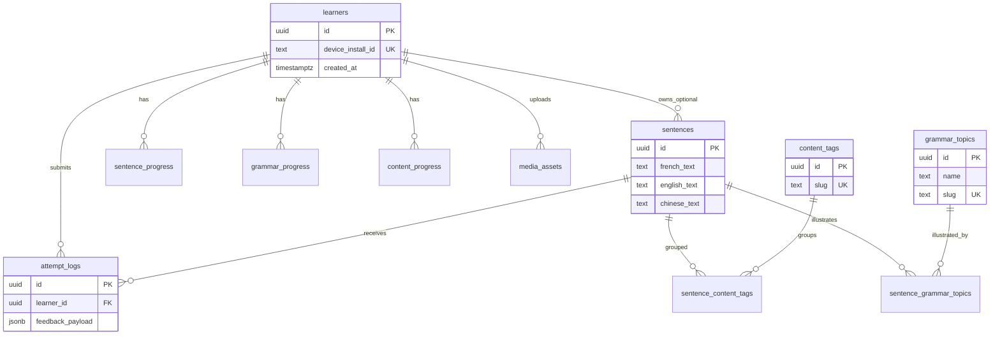

# Motifly — PostgreSQL 数据库模式说明（v1，以学习者为重心）

本文档描述 Motifly **v1 关系型模式**：**无账号 / 无鉴权**；身份通过 **`learners`（设备安装）** 识别；**语法**以可教学的 **`grammar_topics`** 呈现；**场景 / 主题** 通过 **`content_tags`** 分组；**练习记录** 含相似度与 JSON 反馈；在**句子、语法、内容**三个维度做**汇总进度**。音频、图片等二进制文件存放在**对象存储**，不写入 Postgres。

与英文版详细对照见同目录下的 [database_schema.md](database_schema.md)。

---

## 设计心智模型（避免单表承载过多职责）

| 单元 | 表（主要） | 作用 |
| ---- | ---------- | ---- |
| 练习内容 | `sentences`（及关联表） | 用户听写的对象 |
| 教学内容 | `grammar_topics` | 可阅读的语法说明页 |
| 场景分组 | `content_tags` | 旅行、餐厅等情境标签 |
| 学习事件 | `attempt_logs` | 仅追加的练习表现记录 |
| 报表 / 推荐 | `sentence_progress`、`grammar_progress`、`content_progress` | 薄弱项与汇总界面用的聚合数据 |

在 [motifly_prd_mvp.md](motifly_prd_mvp.md) 仍适用的产品方向上保持一致；v1 在 PRD 基础上扩展了**多语言译文**、**语法页**、**更丰富打分**，且 **v1 不使用 JWT**。

---

## v1 范围与后续扩展

**v1 包含**

- `learners` 与 `device_install_id`（设备端 Keychain / UserDefaults 持久化的 UUID）
- 内容表及多对多关联表
- 带 `feedback_payload`（**jsonb**）与 `scoring_version` 的 `attempt_logs`
- 评分引擎跑完后由 API 更新的**聚合进度表**
- 对象存储的预签名上传；可选 `media_assets` 做审计

**延后（后续易加）**

- `users`、Apple 登录、JWT —— 上线账号后在 `learners` 上增加可空的 `user_id` 等关联策略
- 按日汇总表（`grammar_progress_daily`、`content_progress_daily`）用于趋势图
- 重度**语义**打分 —— `semantic_score` 保持可空直至有模型
- 逐字符拆表（v1 用 JSON 即可）
- CDN、微服务、任务队列（评分变慢再加队列）

---

## 命名与类型约定

| 项目 | 选择 |
| ---- | ---- |
| 主键 | `uuid`，默认 `gen_random_uuid()` |
| 时间 | `timestamptz`，UTC |
| 文本 | `text`（法/英/中文及长文语法） |
| 分数 | `double precision`（0–1 或 0–100 由 API 文档约定）；未计算则为可空 |
| 结构化反馈 | `jsonb`（分词/字符差异、缺词等） |
| 布尔 | 适用处 `NOT NULL` 并设默认值 |

---

## 实体关系总览

（表名与英文版一致，便于迁移与工具生成。）

---

## 表：`learners`

匿名学习者，与**一次 App 安装**绑定（v1 的身份根）。

| 列名 | 类型 | 可空 | 默认 | 说明 |
| ---- | ---- | ---- | ---- | ---- |
| `id` | `uuid` | 否 | `gen_random_uuid()` | 主键 |
| `device_install_id` | `text` | 否 | | 设备侧稳定 ID（API 设计时按**秘密**处理） |
| `display_name` | `text` | 是 | | 可选昵称 |
| `created_at` | `timestamptz` | 否 | `now()` | 首次出现时间 |
| `last_seen_at` | `timestamptz` | 否 | `now()` | 每次请求可更新 |

**约束：** `UNIQUE (device_install_id)`  

**演进：** 上线账号后可加 `user_id uuid NULL REFERENCES users(id)`，通过合并或关联行迁移。

---

## 表：`sentences`

核心**练习单元**；含展示与学习用的多语言译文。

| 列名 | 类型 | 可空 | 默认 | 说明 |
| ---- | ---- | ---- | ---- | ---- |
| `id` | `uuid` | 否 | `gen_random_uuid()` | 主键 |
| `french_text` | `text` | 否 | | 打分用的规范法文 |
| `english_text` | `text` | 否 | | 英文译文 |
| `chinese_text` | `text` | 否 | | 中文译文 |
| `notes` | `text` | 是 | | 编辑备注 / 提示 |
| `difficulty_level` | `smallint` | 否 | `1` | 难度 1–5 或产品自定义 |
| `audio_storage_key` | `text` | 是 | | 音频对象键 |
| `image_storage_key` | `text` | 是 | | 图片对象键 |
| `audio_media_id` | `uuid` | 是 | | 可选 → `media_assets.id` |
| `image_media_id` | `uuid` | 是 | | 可选 → `media_assets.id` |
| `source_type` | `text` | 否 | `'system'` | `system` 或 `user_uploaded`（`CHECK`） |
| `owner_learner_id` | `uuid` | 是 | | 用户上传时指向 `learners.id` |
| `is_active` | `boolean` | 否 | `true` | 软下线 |
| `created_at` / `updated_at` | `timestamptz` | 否 | `now()` | |

**评分快照：** `attempt_logs.reference_text_snapshot` 保存当时法文，避免日后改 `french_text` 改写历史。

---

## 表：`grammar_topics`

**教学知识单元**，不仅是标签；驱动语法详情页与薄弱项汇总。

| 列名 | 类型 | 可空 | 默认 | 说明 |
| ---- | ---- | ---- | ---- | ---- |
| `id` | `uuid` | 否 | `gen_random_uuid()` | 主键 |
| `name` | `text` | 否 | | 展示标题 |
| `slug` | `text` | 否 | | 唯一路由键（如 `passe-compose`） |
| `short_description` | `text` | 是 | | 列表/卡片摘要 |
| `full_content` | `text` | 否 | | v1：Markdown 或纯文本正文 |
| `difficulty_level` | `smallint` | 否 | `1` | 与产品难度对齐 |
| `screen_route` | `text` | 是 | | App 内深链路径 |
| `is_active` | `boolean` | 否 | `true` | |
| `created_at` / `updated_at` | `timestamptz` | 否 | `now()` | |

**约束：** `UNIQUE (slug)`  

**演进：** 例句列表用 `sentence_grammar_topics` 多对多表达即可，v1 不必在表里存 `example_sentence_ids` 数组。

---

## 表：`content_tags`

**场景 / 情境** 标签（旅行、餐厅、道歉等）。

| 列名 | 类型 | 可空 | 默认 | 说明 |
| ---- | ---- | ---- | ---- | ---- |
| `id` | `uuid` | 否 | `gen_random_uuid()` | 主键 |
| `name` | `text` | 否 | | 展示名 |
| `slug` | `text` | 否 | | 唯一 |
| `description` | `text` | 是 | | 描述 |
| `created_at` | `timestamptz` | 否 | `now()` | |

---

## 表：`sentence_grammar_topics`

句子与语法主题的 **多对多**（一句可涉及多个语法点）。

| 列名 | 类型 | 可空 | 说明 |
| ---- | ---- | ---- | ---- |
| `sentence_id` | `uuid` | 否 | → `sentences.id` |
| `grammar_topic_id` | `uuid` | 否 | → `grammar_topics.id` |

**主键：** `(sentence_id, grammar_topic_id)`，级联删除。

---

## 表：`sentence_content_tags`

句子与内容标签的 **多对多**。

| 列名 | 类型 | 可空 | 说明 |
| ---- | ---- | ---- | ---- |
| `sentence_id` | `uuid` | 否 | → `sentences.id` |
| `content_tag_id` | `uuid` | 否 | → `content_tags.id` |

**主键：** `(sentence_id, content_tag_id)`，级联删除。

---

## 表：`attempt_logs`

**丰富的练习事件**：判分逻辑在**评分模块**；库内仅存输入、输出与版本。

| 列名 | 类型 | 可空 | 说明 |
| ---- | ---- | ---- | ---- |
| `id` | `uuid` | 否 | 主键 |
| `learner_id` | `uuid` | 否 | → `learners.id` |
| `sentence_id` | `uuid` | 否 | → `sentences.id` |
| `raw_input_text` | `text` | 否 | 用户原始输入 |
| `normalized_input_text` | `text` | 否 | 引擎规范化后 |
| `reference_text_snapshot` | `text` | 否 | 提交瞬间的法文参考答案快照 |
| `similarity_score` | `double precision` | 否 | 主综合指标（0–1 或 0–100 见 API） |
| `spelling_score` | `double precision` | 是 | 拼写子分 |
| `grammar_accuracy_score` | `double precision` | 是 | 语法子分 |
| `semantic_score` | `double precision` | 是 | 预留 ML 语义分 |
| `input_duration_ms` | `integer` | 是 | 输入耗时 |
| `character_count` / `token_count` | `integer` | 是 | 字符/词元计数（定义随 `scoring_version`） |
| `feedback_payload` | `jsonb` | 否 | 分词/字符级反馈、缺词等 |
| `scoring_version` | `text` | 否 | 如 `sim-2026-04-01` |
| `created_at` | `timestamptz` | 否 | |

**索引：** 常见为 `(learner_id, created_at DESC)`、`(learner_id, sentence_id, created_at DESC)`，便于时间窗口分析。

---

## 表：`sentence_progress`

每位学习者、每个句子的**聚合**（每次计分后更新）。

主要字段：`attempt_count`、最新/最佳/平均相似度、平均输入时长、`retrieval_score`、`mastery_score`、`needs_review`、`last_attempted_at` 等。  

**主键：** `(learner_id, sentence_id)`。  

**用途：** 复习队列、按掌握度排序。

---

## 表：`grammar_progress`

某学习者在该**语法主题**下跨句子的表现汇总。

含：`sentence_coverage_count`、`attempt_count`、`average_similarity_score`、`retrieval_score`、`mastery_score`、`last_practiced_at` 等。  

**主键：** `(learner_id, grammar_topic_id)`。  

**用途：** 汇总页「薄弱语法」、推荐练习。

---

## 表：`content_progress`

同上，维度换为**内容标签**（场景）。

**主键：** `(learner_id, content_tag_id)`。  

**用途：** 「薄弱场景/主题」汇总。

---

## 表：`media_assets`（可选，上传多时推荐）

上传文件的元数据；`sentences` 可通过 `audio_media_id` / `image_media_id` 引用。

| 列名 | 类型 | 可空 | 说明 |
| ---- | ---- | ---- | ---- |
| `id` | `uuid` | 否 | 主键 |
| `owner_learner_id` | `uuid` | 否 | → `learners.id` |
| `storage_key` | `text` | 否 | 唯一对象键 |
| `media_type` | `text` | 否 | `audio` 或 `image` |
| `content_type` | `text` | 否 | MIME |
| `byte_size` | `bigint` | 否 | 字节数 |
| `duration_ms` | `integer` | 是 | 音频时长 |
| `created_at` | `timestamptz` | 否 | |

首版若省略此表，仅依赖 `sentences` 上的 `*_storage_key` 亦可，后续再迁移。

---

## 汇总界面与时间窗口

**v1 建议：** 聚合表保持「当前快照」；「近 7 天最弱」等需求通过对 **`attempt_logs`** 按 `created_at` 过滤，再经 `sentence_grammar_topics` / `sentence_content_tags` 连接分组。需要趋势图时再上**按日汇总表**。

若时间窗口查询变热，可为 `attempt_logs(created_at)` 等加**部分索引**。

---

## 评分模块（应用边界）

Postgres **不实现**相似度或掌握度公式。推荐流程：

1. API 接收练习请求与可选耗时元数据。  
2. **评分引擎**（Python 子进程、独立 HTTP 服务等）返回规范化文本、各分数、`feedback_payload`、对检索/掌握度的增量建议。  
3. API 写入 `attempt_logs`，再在同一事务中更新三张 `*_progress` 表（若引擎异步则可用补偿流程）。

每条记录带 `scoring_version`，便于算法升级后仍可读历史。

---

## 参考 DDL

与 [database_schema.md](database_schema.md) 末尾 **Reference DDL** 章节**完全一致**（便于 Prisma / Drizzle / Alembic 对照）。请直接打开英文文件复制 SQL，或保持两文件 DDL 同步更新。

---

## 表一览（速查）

| 表名 | 作用 |
| ---- | ---- |
| `learners` | v1 身份（设备安装） |
| `sentences` | 练习单元 + 译文 + 媒体指针 |
| `grammar_topics` | 可教学的语法内容页 |
| `content_tags` | 场景/情境标签 |
| `sentence_grammar_topics` | 句子 ↔ 语法 多对多 |
| `sentence_content_tags` | 句子 ↔ 内容标签 多对多 |
| `attempt_logs` | 计分后的练习记录 + JSON 反馈 |
| `sentence_progress` | 每句掌握度聚合 |
| `grammar_progress` | 按语法主题的薄弱汇总 |
| `content_progress` | 按内容标签的薄弱汇总 |
| `media_assets` | 可选的上传台账 |

整体保持**报表友好**、**判分逻辑在应用层**、并预留**账号、按日汇总、ML 字段**等后续扩展而不破坏 v1 数据行。
