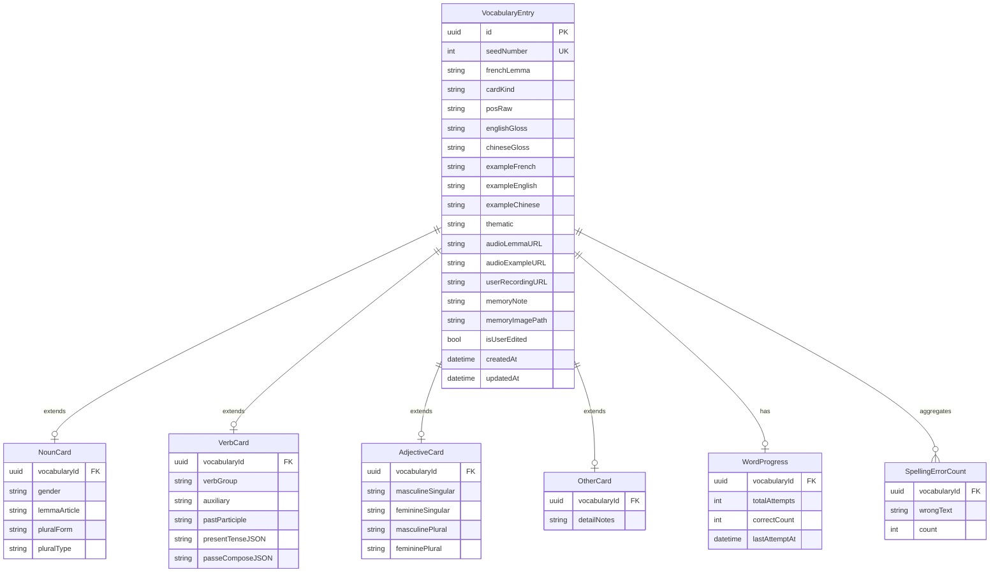

# Motifly — Version 1 vocabulary schema (SwiftData–oriented)

Local-first storage for **word cards** (noun / verb / adjective / other), **user progress**, and **spelling mistake tallies**, aligned with [prototype/french_vocab_card_prototypes.tsx](prototype/french_vocab_card_prototypes.tsx) and [data_seed/](data_seed/) CSV imports.

This is **not** the Postgres schema in [database_schema.md](database_schema.md) (that targets v2 sentences + server). Map v1 → v2 later via stable **`seedNumber`** or **`stableKey`** on each entry.

---

## Design principles

1. **One row per headword** in `VocabularyEntry` (shared shell: lemma, glosses, example, POS, kind).
2. **Type-specific data** in separate 1:1 models (`NounCard`, `VerbCard`, `AdjectiveCard`, `OtherCard`) so you avoid dozens of nullable columns on one table.
3. **Progress** lives on the learner side (`WordProgress`, `SpellingErrorCount`) — updated when the user practices typing the headword (or example).
4. **Conjugation / tables** for verbs: store as **JSON strings** (or small Codable structs) in v1; normalize to relational tables only if you need queries inside conjugation data.

---

## Entity overview



---

## 1. `VocabularyEntry` (required)

| Field | Type | Notes |
|-------|------|--------|
| `id` | UUID | Primary key |
| `seedNumber` | Int? | Matches CSV `number`; unique when present |
| `frenchLemma` | String | Headword shown in header |
| `cardKind` | Enum | `noun` \| `verb` \| `adjective` \| `other` — drives which sub-card exists |
| `posRaw` | String | Original `pos` from seed (e.g. `det,nm`) |
| `englishGloss` | String | |
| `chineseGloss` | String | Maps prototype “English / 中文” blocks |
| `exampleFrench` | String | |
| `exampleEnglish` | String | |
| `exampleChinese` | String? | Optional until translated |
| `thematic` | String? | From seed `thematic` |
| `audioLemmaURL` / `audioExampleURL` | String? | Bundled name or file URL |
| `userRecordingURL` | String? | “My recording” |
| `memoryNote` | String? | Editable note (Memory Support) |
| `memoryImagePath` | String? | Local sandbox path |
| `isUserEdited` | Bool | User overrides vs seed |
| `createdAt` / `updatedAt` | Date | |

**Exactly one** of `NounCard`, `VerbCard`, `AdjectiveCard`, `OtherCard` should be populated according to `cardKind`. Import pipelines set this from [seed_nouns.csv](data_seed/seed_nouns.csv), [seed_adjectives.csv](data_seed/seed_adjectives.csv), [seed_verbs.csv](data_seed/seed_verbs.csv), or `other` for unclassified.

---

## 2. `NounCard` (1:1, when `cardKind == noun`)

| Field | Type |
|-------|------|
| `vocabulary` | Relationship → `VocabularyEntry` |
| `gender` | String | e.g. `m`, `f`, `both` |
| `lemmaArticle` | String | e.g. `la`, `le`, `l’` |
| `pluralForm` | String |
| `pluralType` | String | e.g. `regular -s`, `irregular` |

---

## 3. `VerbCard` (1:1, when `cardKind == verb`)

| Field | Type |
|-------|------|
| `verbGroup` | String? | e.g. `1er groupe` |
| `auxiliary` | String? | `avoir` / `être` |
| `pastParticiple` | String? | |
| `presentTenseJSON` | String | JSON array of `{ "person": "je", "form": "parle" }` or similar |
| `passeComposeJSON` | String | Same idea for PC mini table |

v1 can **omit** mini tables in DB until you have seed data; UI can hide collapsibles when strings are empty.

---

## 4. `AdjectiveCard` (1:1, when `cardKind == adjective`)

| Field | Type |
|-------|------|
| `masculineSingular` | String |
| `feminineSingular` | String |
| `masculinePlural` | String |
| `femininePlural` | String |

---

## 5. `OtherCard` (1:1, when `cardKind == other`)

| Field | Type |
|-------|------|
| `detailNotes` | String? | Free text for adv / prep / mixed POS until you specialize |

---

## 6. `WordProgress` (0..1 per entry)

| Field | Type |
|-------|------|
| `vocabulary` | → `VocabularyEntry` |
| `totalAttempts` | Int |
| `correctCount` | Int |
| `lastAttemptAt` | Date? |

**Accuracy** in UI = `correctCount / max(totalAttempts, 1)` (or store a cached `accuracy` Double if you prefer).

---

## 7. `SpellingErrorCount` (0..N)

| Field | Type |
|-------|------|
| `vocabulary` | → `VocabularyEntry` |
| `wrongText` | String | Normalized mistaken string (what user typed) |
| `count` | Int |

Unique constraint on `(vocabulary, wrongText)`. Powers “Top errored spellings” on the card.

---

## Indexes (SwiftData / queries)

- `VocabularyEntry.seedNumber` (unique)
- `VocabularyEntry.cardKind` (filter tabs / library)
- `SpellingErrorCount` by `vocabulary` + descending `count`

---

## Import notes

- Map CSV columns → `VocabularyEntry` + the correct sub-card; noun CSV adds `NounCard` fields from [seed_nouns.csv](data_seed/seed_nouns.csv) (`gender`, `lemma_article`, etc.).
- `cardKind` should follow your split scripts, not only raw POS (e.g. pronouns may be `other`).

---

# Version 1 app skeleton (tabs)

Three-tab `TabView` (SwiftUI). Each tab is a **navigation stack** so detail screens push cleanly.

## Tab 1 — Vocabulary

| Screen | Role |
|--------|------|
| **Library** | List: search, filter by `cardKind`, optional thematic; row shows lemma + POS badge + optional progress snippet |
| **Word card detail** | Single `VocabularyEntry` + sub-card view by kind; shared: header (lemma, audio, recording), EN/ZH, example FR + EN (+ ZH); collapsibles: type-specific module, memory, progress |
| **Settings (optional)** | Import reset, audio prefs — can live under gear on library |

**View split (matches manual card building):**

- `SharedCardShell` — header, translations, example, memory, progress shell
- `NounCardModule` / `VerbCardModule` / `AdjectiveCardModule` / `OtherCardModule` — injected by `cardKind`

## Tab 2 — Practice (placeholder for v2)

- v1: **“Coming in v2”** or short **word drill** only (type the lemma) using same `WordProgress` / `SpellingErrorCount`
- v2: sentence dictation replaces this content per [motifly_prd_mvp.md](motifly_prd_mvp.md) Part B

## Tab 3 — Study log

| Screen | Role |
|--------|------|
| **Log home** | Recent attempts (`lastAttemptAt`), weak words (low accuracy or high error counts), optional favorites |
| **Entry detail** | Same as word card or compact: progress + error histogram |

Optional: **SRS fields** later (`nextReviewAt`, `intervalDays`) on `WordProgress` without changing the v1 shape above.

---

## File layout (suggested)

```
MotiflyApp/
  App/
    MotiflyApp.swift          // modelContainer, TabView
  Tabs/
    VocabularyTab.swift
    PracticeTab.swift         // v1 placeholder or mini drill
    StudyLogTab.swift
  Features/
    Library/
    WordCard/
      SharedCardShell.swift
      Modules/
        NounCardModule.swift
        VerbCardModule.swift
        AdjectiveCardModule.swift
        OtherCardModule.swift
    StudyLog/
  Models/                     // SwiftData @Model classes
  Services/
    SeedImportService.swift
```

This keeps **prototype → schema → screens** aligned while staying minimal for a first shippable v1.
